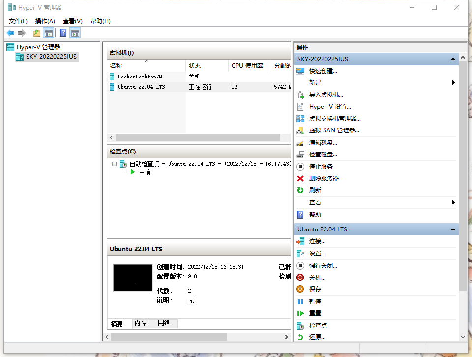
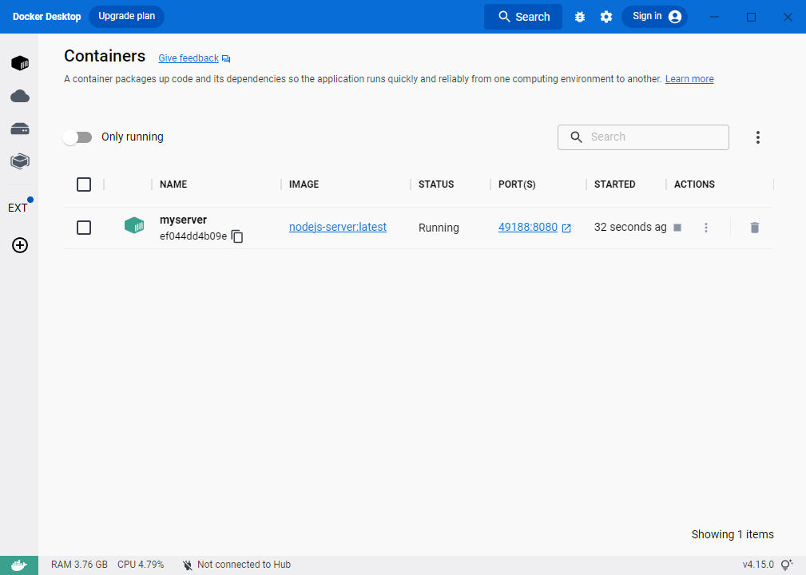
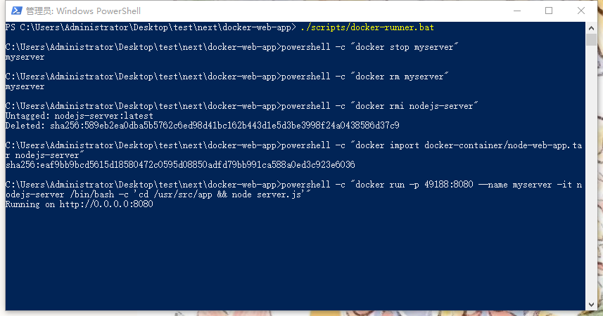
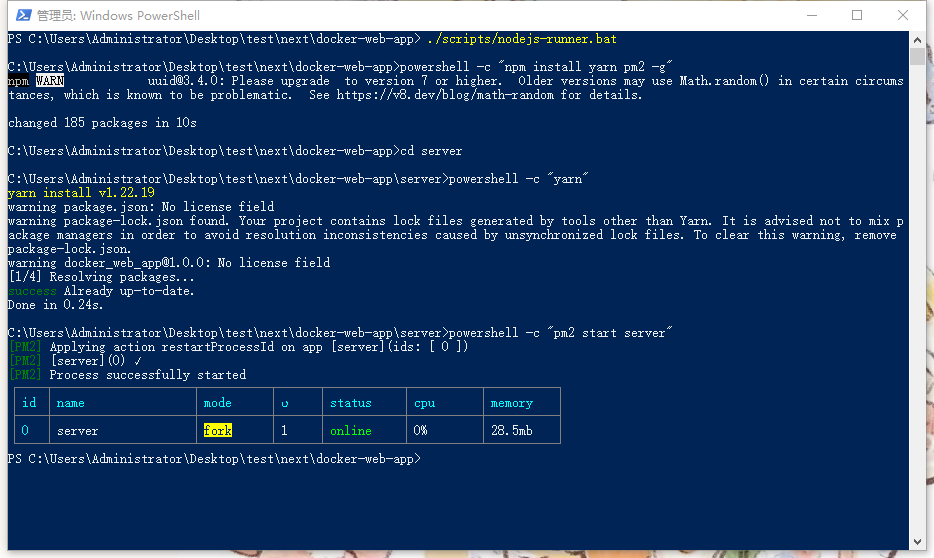

# docker-web-app

## Plan A
use Docker to start service. The advantage is to isolate container status and prevent tool version conflicts.The disadvantage is that the operation is complex, and the server may not support virtualization.

### System
os: window 10

### Install virtual machine
`Note: If the server does not support Hyber-v, please go to Plan B`
1. Install the virtualization tool that comes with the window, `Control Panel` -> `Enable or disable the window function`
2. Select `Hyper-V`
3. Reset computer
4. Open `Hyper-V` -> Quick Create -> Select `Ubuntu`
5. Register users and log in to the system

### Install docker and start service
1. install docker desktop `https://www.docker.com/`
2. open `Docker Desktop`
3. `cd docker-web-app`
4. `./scripts/docker-runner.bat`
5. Close the terminal

### Verification
Open in browser `http://localhost:49188/`

### Plan B
Deploy the nodejs service environment directly on the current server, and the database may be installed later

### Install nodejs and start service
1. install nodejs `https://nodejs.org/en/`
2. `cd docker-web-app`
3. `./scripts/nodejs-runner.bat`

### Verification
Open in browser `http://localhost:8080/`

